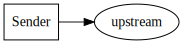

# CloudEvents Golang SDK v2

Version 2 of this SDK takes lessons learned from the original effort and updates
the API into how we have seen v1 integrate into systems.

## Terms

- [Event](https://github.com/cloudevents/spec/blob/master/spec.md#event), an
  Event is the conical form of the attributes and payload of the occurrence.
- [Message](https://github.com/cloudevents/spec/blob/master/spec.md#message), a
  Message is the encoded form of an Event for a given encoding and protocol.
- [Protocol](https://github.com/cloudevents/spec/blob/master/spec.md#protocol),
  a Protocol is the over-the-wire format that Messages are sent.
- [Protocol Binding](https://github.com/cloudevents/spec/blob/master/spec.md#protocol-binding),
  a Protocol Binding defines how Events are mapped into Messages for the given
  Protocol.
- Client, a client contains the logic of interacting with a Protocol to enable
  interactions with Events. Clients also provide protocol agnostic features that
  can be applied to events, such as extensions.
- Extensions, an extension is anything that extends the base requirements from
  the CloudEvents spec. There are several
  [CloudEvents supported extensions](https://github.com/cloudevents/spec/tree/master/extensions).

## Investment Level

The amount of the SDK adopters would like to use is up to the adopter. We
support the following:

- Resource Level, an Event can be used directly, and can be marshaled in and and
  out of JSON.
- Bindings Level, a Protocol can be used directly, with facilities to aid in
  converting an Event into a Message by using a Protocol Binding.
- Client Level, a Protocol can be selected and Events can be directly sent and
  received without requiring interactions with Message objects.

## Personas

- [Producer](https://github.com/cloudevents/spec/blob/master/spec.md#producer),
  the "producer" is a specific instance, process or device that creates the data
  structure describing the CloudEvent.
- [Consumer](https://github.com/cloudevents/spec/blob/master/spec.md#consumer),
  a "consumer" receives the event and acts upon it. It uses the context and data
  to execute some logic, which might lead to the occurrence of new events.
- [Intermediary](https://github.com/cloudevents/spec/blob/master/spec.md#intermediary),
  An "intermediary" receives a message containing an event for the purpose of
  forwarding it to the next receiver, which might be another intermediary or a
  Consumer. A typical task for an intermediary is to route the event to
  receivers based on the information in the Context.

## Interaction Models

The SDK enables the following interaction models.

### Sender

Sender, when a Producer is creating new events.

### Receiver

Receiver, when a Consumer is accepting events.

### Forwarder

Forwarder, when a Intermediary accepts an event only after it has successfully continued the message to one or more Consumers.

### Mutator

Mutator, when a Producer or Intermediary blocks on a response from a Consumer, replacing the original Event.

---

# For Integrators

To leverage the SDK, the following interfaces need to be considered:

Event -> Message -> bits

bits -> Message -> Event

bit -> Message -> bits

