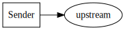
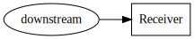
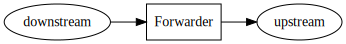
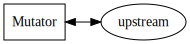

# Architecture and Concepts
{: .no_toc }

1. TOC
{:toc}

## Spec and SDK Terms

- [Event](https://github.com/cloudevents/spec/blob/master/spec.md#event): 
  The canonical form of the attributes and payload of the occurrence.
- [Protocol](https://github.com/cloudevents/spec/blob/master/spec.md#protocol): 
  Protocol is the messaging protocol used to send/receive events. In sdk-go all supported 
  Protocols are implemented through specific interfaces in 
  [`protocol` module](../v2/protocol).
- [Protocol Binding](https://github.com/cloudevents/spec/blob/master/spec.md#protocol-binding): 
  Definition of how Events are mapped into Messages for the given Protocol. In sdk-go all
  supported Protocol bindings are implemented through specific interfaces in 
  [`binding` module](../v2/binding).
- [Message](https://github.com/cloudevents/spec/blob/master/spec.md#message): 
  The encoded form of an Event for a given encoding and protocol. 
  When a message is received in the sdk-go, the protocol implementation wraps it in a 
  [`Message`](../v2/binding/message.go)
  implementation specific to that protocol. This interface defines how to read the Message, 
  given the Protocol.
- Message Writer: Logic required to take in a `Message` in a specific encoding and write out to a
  given Protocol (request, message). A Message Writer can be a 
  [`StructuredWriter`](../v2/binding/structured_writer.go), 
  a [`BinaryWriter`](../v2/binding/binary_writer.go) or both, depending on what encodings a 
  Protocol supports.
- [`Client`](../v2/client/client.go): Interface to interact with a Protocol implementation 
  to send/receive Events. Clients also provide protocol agnostic features that can be 
  applied to events, such as extensions.
- Extensions: Anything that extends the base requirements from the CloudEvents spec. 
  There are several
  [CloudEvents supported extensions](https://github.com/cloudevents/spec/tree/master/extensions).

## Investment Level

The amount of the SDK adopters would like to use is up to the adopter. We
support the following:

- [Resource Level](event_data_structure.md): An adopter could use the Event data structure to interact with CloudEvents 
  and marshal/unmarshal it to JSON.
- [Message Level](protocol_implementations.md): An adopter could use directly `Message`s implementations and `Write*` functions 
  to read and write CloudEvents messages from/to the wire, handling by hand the connection, the 
  consumption and the production of messages from/to the protocol specific APIs.
- [Protocol Level](protocol_implementations.md): An adopter could use Protocol implementations directly to consume/produce `Message`s
  without interacting with the protocol specific APIs.
- [Client Level](../v2/client/client.go): An adopter selects a Protocol implementation and Events can 
  be directly sent and received without requiring interactions with `Message`s.

## Personas

- [Producer](https://github.com/cloudevents/spec/blob/master/spec.md#producer),
  the "producer" is a specific instance, process or device that creates the data
  structure describing the CloudEvent.
- [Consumer](https://github.com/cloudevents/spec/blob/master/spec.md#consumer),
  a "consumer" receives the event and acts upon it. It uses the context and data
  to execute some logic, which might lead to the occurrence of new events.
- [Intermediary](https://github.com/cloudevents/spec/blob/master/spec.md#intermediary),
  An "intermediary" receives a message containing an event for the purpose of
  forwarding it to the next receiver, which might be another intermediary or a
  Consumer. A typical task for an intermediary is to route the event to
  receivers based on the information in the Context.

## Interaction Models

The SDK enables the following interaction models.

### Sender

Sender, when a Producer is creating new events.

### Receiver

Receiver, when a Consumer is accepting events.

### Forwarder

Forwarder, when a Intermediary accepts an event only after it has successfully
continued the message to one or more Consumers.

### Mutator

Mutator, when a Producer or Intermediary blocks on a response from a Consumer,
replacing the original Event.

