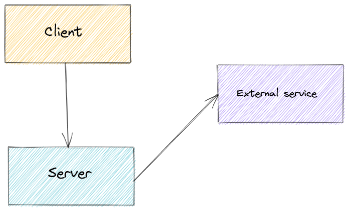
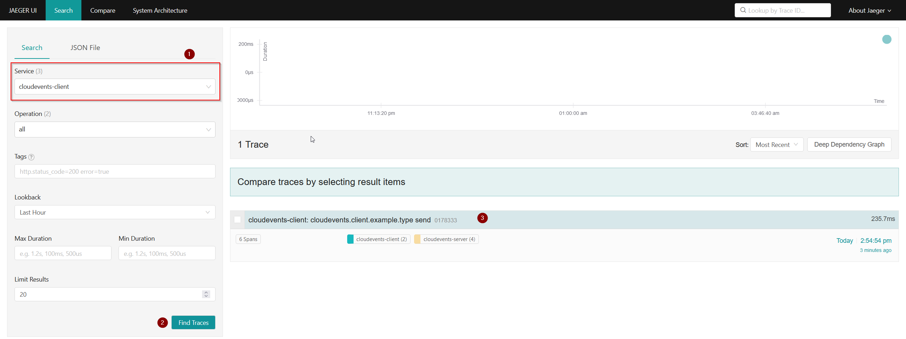
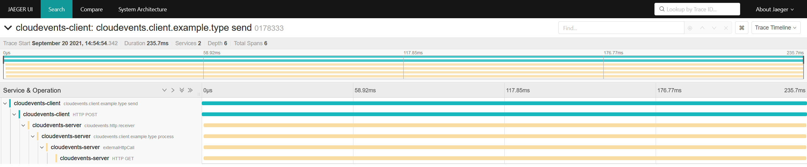

# CloudEvents with OpenTelemetry instrumentation

This sample demonstrates both client and server apps using CloudEvents instrumented with OpenTelemetry. 

> If this is your first time hearing about OpenTelemetry, take a look at the official documentation: [What is OpenTelemetry](https://opentelemetry.io/docs/concepts/what-is-opentelemetry/).

The client app sends an event using CloudEvents to a server. The server listens for events also using CloudEvents. For each event it receives, it makes then an external HTTP request to `cloudevents.io`, just to illustrate the context propagation working. 

Here's a diagram to examplify the communication between the components:



Both apps are configured to send the spans to a locally running [Jaeger](https://www.jaegertracing.io/) instance. See instructions below on how to run everything.

## Requirements to run

- Docker/Compose
- Go

## Running the sample

1. Download dependencies

```shell
$ cd sdk-go\samples\http
$ go mod download
$ cd otel-sender-receiver
```

2. Start the Jaeger container

```shell
$ docker-compose up
```

3. Run the server and the client

```shell
$ go run server/server.go
```

```shell
$ go run client/client.go
```

4. Open the Jaeger UI (by default Jaeger exposes the UI at [http://localhost:16686](http://localhost:16686))

5. On the `Service` dropdown select `cloudevents-client`. Next, click on `Find Traces`. 



6. On the right side you should see a trace with name `cloudevents-client: cloudevents.client.example.type send`. Click there to see the full trace:


